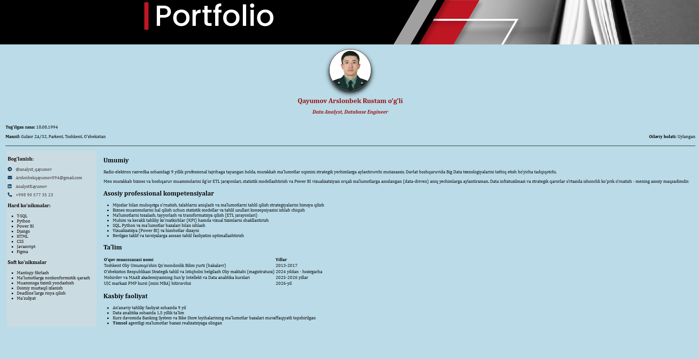

# My-Profile
Created my profile in HTML

### Bu mening HTML tilidan foydalanib yaratgan loyiham!
<h3>Loyiha nomi: My Profile<h3>

<h4>Loyiha shiori: Shoshilmasdan, shiddat bilan harakat qil! <h4>

Xususiyatlari: "Bu sahifada mening profilim haqida batafsil ma'lumotlar berilgan".

Ishlatilgan texnologiyalar: * HTML5, CSS3.

 <h3>Bog'lanish:</h3>
                <ul class="contact-list">
                    <li>
                        <i class="fa-brands fa-telegram"></i> 
                        <a href="https://t.me/analyst_qayumov" target="_blank">@analyst_qayumov</a>
                    </li>
                    <li>
                        <i class="fa-solid fa-envelope"></i> 
                        <a href="mailto:Arslonbekqayumov094@gmail.com">Arslonbekqayumov094@gmail.com</a>
                    </li>
                    <li>
                        <i class="fa-brands fa-linkedin"></i> 
                        <a href="https://linkedin.com/in/AnalystKayumov" target="_blank">AnalystKayumov</a>
                    </li>
                   </ul>